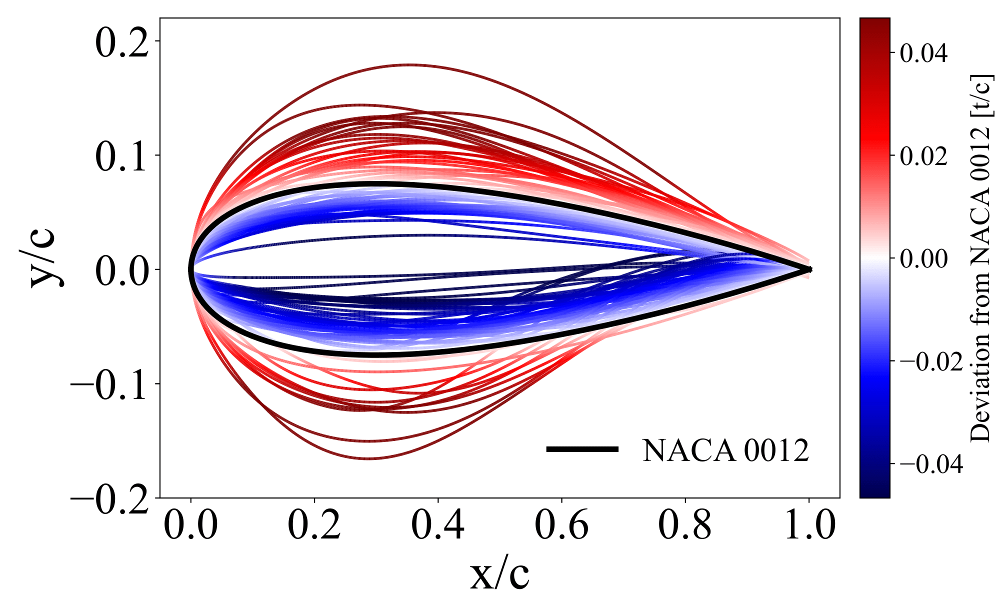
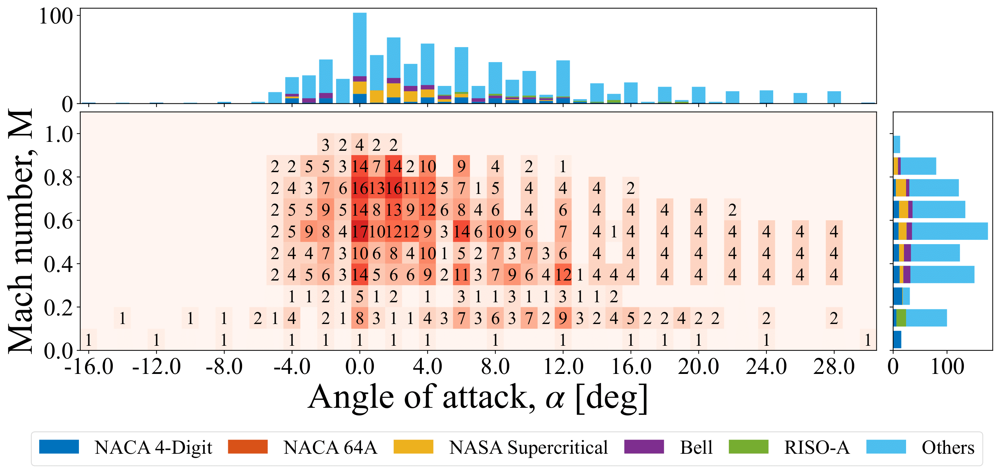
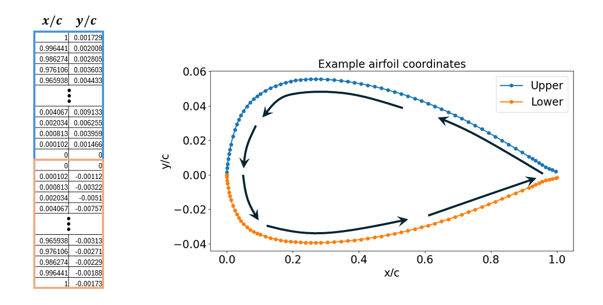
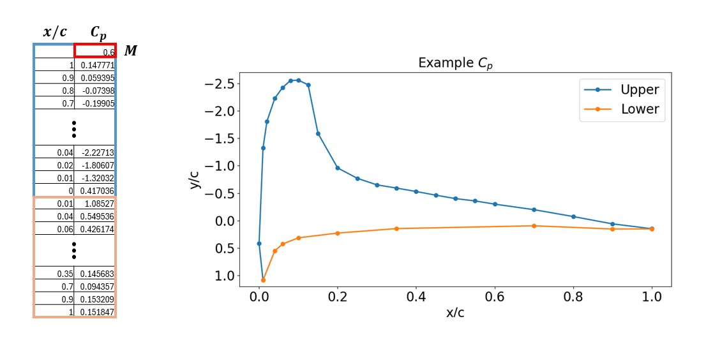

## ASPIRE - Airfoil Surface Pressure Information Repository of Experiments 
**ASPIRE** is an open-source database accessible to the wider aerospace community utilizing the vast, nearly century-old historical repository of experimental airfoil data. It was first released on XX/XX/2024 (__insert date here__) in a paper by Lee et al. (__hyperlink the paper when arXiv link is available__)

The database was established through an extensive data mining operation for _strictly experimental_ pressure distributions for a variety of airfoils. Each entry of ASPIRE consist of experimental $C_p$ measurements for various airfoil geometries, angles of attack ($\alpha$), chord-based Reynolds numbers ($Re$), and Mach numbers ($M$). The complete list of fully digitized  as well as those in progress can be found <a href="https://docs.google.com/spreadsheets/d/1lj5McgJFJEJ30k7VjSC_P2WIVK0ZOVxvso0a-UtzDUc/edit?usp=sharing">here</a>.

## Available Data
ASPIRE consists of **2141 unique pressure distributions** from **61 airfoils** from various airfoil families and applications. All profiles of the airfoils included in the database, compared against the commonly studied NACA 0012, is shown below. Airfoil profiles thicker than a NACA 0012 at the given chordwise location are colored in varying shades of red. Profiles thinner than the NACA 0012 are colored in shades of blue.

<div align="center">
  
  <p style="text-align: center;">Geometric profiles of all airfoils in the database colored by their thickness compared to the baseline airfoil of NACA 0012</p>
</div>

The available data ranges from $-30^{\circ}$ to $30^{\circ}$ in angles of attack ($\alpha$). The Mach number ($M$) of the data spans $0.0$ to $1.0$, from the incompressible regime to transonic and sonic regimes. The number of available pressure data in terms of unique airfoils at a given $M$ and $\alpha$ is shown in below. The color and the number in the center plot denotes the number of unique airfoils available for a given $M$ - $\alpha$ combination. Marginal histograms are plotted to provide a clear visualization of the available data at specific $\alpha$ or $M$. These are split in terms of airfoil families, design usage, and supercriticality.

<div align="center">
  
  <p style="text-align: center;">Distribution of available airfoil pressure data and the marginal histograms categorized by airfoil family</p>
</div>
<div align="center">
  
  <p style="text-align: center;">Distribution of available airfoil pressure data and the marginal histograms categorized by airfoil usage</p>
</div>
<div align="center">
  
  <p style="text-align: center;">Distribution of available airfoil pressure data and the marginal histograms categorized by supercritical airfoil</p>
</div>

_Last updated on 7/31/2024_

## Data Format 
Each airfoil folder should contain 3 types of files: the coordinate file (csv), pressure data files (csv), and tag file (json). 
### Coordinates File
The coordinate files will define the geometry of the airfoil, with the first column being the normalized chordwise location ($x/c$) and the second column being the normalized thickness ($y/c$) as seen below. The order of the coordinates should start from the upper surface of the trailing edge ($x/c = 1.0$) to the leading edge ($x/c = 0.0$) and end at the lower surface of the trailing edge ($x/c = 1.0$). The coordinate files should be named: `<airfoilname>_coordinates.csv`. 
<div align="center">
  
  <p style="text-align: center;">Visualization of airfoil coordinates file format</p>
</div>

### Pressure File
Each CSV file consists of the airfoil pressure measurements along the entire wing chord at a given angle of attack and Mach number. The file should following the naming scheme of  `<airfoilname>_A<angle of attack> _M<Mach number>_Re<Reynolds number>_A.csv`. A negative angle of attack should have an "m" in front of the angle attack to denote the minus sign. For a NACA0012 airfoil at $\alpha = -2.1^\circ$, $M = 0.3$, and $Re = 3.0 \times 10^6$ would have the file name `NACA0012_Am2.1_M0.30_Re3e6_A.csv`. 

Just like the coordinates file, the first column corresponds to the normalized chordwise location ($x/c$) in the same order of Upper TE &#8594; LE &#8594; Lower TE. The second column is the pressure coefficient at the given chordwise location. The very first entry denotes the Mach number of the experiment. This format is visualized below. 
<div align="center">
  
  <p style="text-align: center;">Visualization of airfoil pressures file format</p>
</div>

### Tag File
In many sources, the experimental accuracy are reported by the authors within an report. These are often reported as a single scalar value in terms of the maximum magnitude of the error, or the maximum percentage error. These values were recorded in the ASPIRE in an accompanying tag file. Additionally, if the uncertainties in the independent variables such as those of the freestream Mach number, angles of attack, or pressure sensor locations were found in references, they were also reported in the tag files. An example of the tag file included in the database can be seen in below.
<div align="center">
  
  <p style="text-align: center;">Format of tag files found for each experiment in ASPIRE</p>
</div>

## Getting Started
### Download
To access all airfoil experimental data in ASPIRE, run the following:
```
git clone https://github.com/hwlee924/Large-Airfoil-Model.git
cd Large-Airfoil-Model
```

### How to contribute
Refer to the <a href="https://docs.google.com/spreadsheets/d/1lj5McgJFJEJ30k7VjSC_P2WIVK0ZOVxvso0a-UtzDUc/edit?usp=sharing">here</a> to identify a data source that needs to be digitized and request edit access. If you have a specific document that you would like to work on that is not on the file, add an entry to the spreadsheet.

Please ensure that the data adheres to the format outlined in the previous section. For guidance on how to digitize publicly available experimental data, please refer to the Experimental Data Digitization section.

## Experimental Data Digitization
### Sources
There are largely three ways that I have been using to obtain experimental airfoil pressure data: Google Scholar, Aerospace Research Central (ARC), and NASA Technical Reports Server (NTRS).
1. **Google Scholar:** In Google Scholar, you can essentially "google" existing papers. Use appropriate key words such as "airfoil pressure distribution", "wind tunnel investigation", etc. to find a wide variety of existing papers from different sources. Most of these will involve graphical plots of pressure data.
2. **Aerospace Research Central:** ARC is hosted by AIAA and will give you papers that they have hosted in AIAA conferences and journals. If you are part of an academic institution, you should likely have access to the database. The website is more focused than Google Scholar but has a good variety of all aerospace-related literature. As with Google Scholar, most of these will involve graphical plots of pressure data.
3. **NASA Technical Reports Server:** NTRS specifically hosts NASA's technical reports. While these documents are often very old, they also provide the most extensive coverage of a variety high quality airfoil experiments. Most of the data has a combination of tabulated and graphical results. This lets you verify your digitization relatively easily. However, due to the age of many documents, the quality of the scanned PDFs may be poor.

### Digitizing Tabulated Data
If the source material presents the experimental data in a tabulated format, I recommend that you use Optical Character Recognition (OCR) tools available online. Personally, I got best results from <a href="https://extracttable.com">ExtractTable</a>. 

The workflow of using an OCR tool of your choice is as follows:
- Take a screenshot of the table that you want to digitize. 
- In your choice of online OCR tool, upload the screenshot. 
- When the conversion is complete, copy the data to clipboard and paste it into the csv file in Excel.
- Make sure the digitization was done accurately. Fix erroneous results as necessary.
- Rearrange the data into the previously described data format.

### Digitizing Graphical Data
If the source material presents the experimental data in a graphical format (plot), I recommend that you use the online tool <a href="https://automeris.io/WebPlotDigitizer.html">WebPlotDigitizer</a>.

The workflow of using WebPlotDigitizer is as follows:
- Click `Launch v5`. You may need to create an account.
- Take a screenshot of the graph that you want to digitize. 
- In WebPlotDigitizer, upload the screenshot: `Files` &#8594; `Load Image(s)`. 
- Calibrate the X- and Y-axes. Click on the minimum and maximum values of each axes and click `Complete!`. Then, enter their numerical values. 
- Click on the plot points to digitize the data. Make sure you click the points in the order of: Trailing edge, upper surface &#8594; Leading edge &#8594; Trailing edge, lower surface.
- When finished, click `View Data` on the left and `Copy to clipboard`. Paste the result into the csv file in Excel.
- Make sure the digitization was done accurately. Fix erroneous results as necessary.
- Rearrange the data into the data format described earlier.

### Notes
- In many cases, digitization is difficult due to poor legibility of tabulated data, the value should be determined indirectly by comparing it to the plotted results (if available), estimating based on the authors' best knowledge of airfoil pressure distribution trends, or omitting the data point.
- In cases where digitization is difficult due to clustering of points at the leading and trailling edge, the data points should be carefully extracted by zooming in. This estimate should be informed the authors' knowledge of airfoil physics. If this is not viable, the point should be omitted.  

[comment]: # (Howon's To do)
[comment]: # (When more Re becomes available, maybe make plots wrt that)
[comment]: # (Remove sources?)
[comment]: # (Include LAM codes?)

