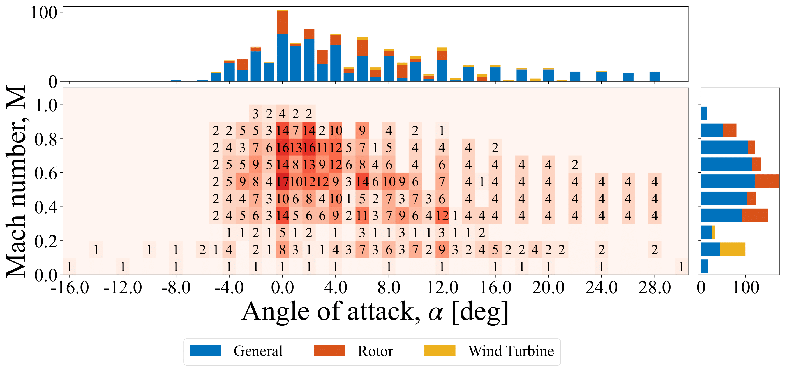

## ASPIRE - Airfoil Surface Pressure Information Repository of Experiments 
ASPIRE is an open-source database accessible to the wider aerospace community utilizing the vast, nearly century-old historical repository of experimental airfoil data 

The database was established through an extensive data mining operation for \emph{strictly experimental} pressure distributions for a variety of airfoils. Each entry of ASPIRE consist of experimental $C_p$ measurements for various airfoil geometries, angles of attack ($\alpha$), chord-based Reynolds numbers ($Re$), and Mach numbers ($M$).

- Shout out to Paper w/ arxiv link when available
- 
Airfoil Database Link:  
https://docs.google.com/spreadsheets/d/1lj5McgJFJEJ30k7VjSC_P2WIVK0ZOVxvso0a-UtzDUc/edit?usp=sharing

## Available Data
ASPIRE consists of 2141 unique pressure distributions from 61 airfoils from various airfoil families and applications. All profiles of the airfoils included in the database, compared against the commonly studied NACA 0012, is shown below. Airfoil profiles thicker than a NACA 0012 at the given chordwise location are colored in varying shades of red. Profiles thinner than the NACA 0012 are colored in shades of blue.

  

<figure class="image">
  
  <figcaption>{{ include.description }}</figcaption>
</figure>

The available data ranges from $-30^{\circ}$ to $30^{\circ}$ in angles of attack ($\alpha$). The Mach number ($M$) of the data spans $0.0$ to $1.0$, from the incompressible regime to transonic and sonic regimes. The number of available pressure data in terms of unique airfoils at a given $M$ and $\alpha$ is shown in Fig. \ref{fig:avail_data}. The color and the number in the center plot denotes the number of unique airfoils available for a given $M$ - $\alpha$ combination. Marginal histograms are plotted to provide a clear visualization of the available data at specific $\alpha$ or $M$. These are split in terms of airfoil families, design usage, and supercriticality.

  

  

  

- will consider Re later
  
## Getting Started
- include points about how to download
- include description of how to contribute
  
## Experimental Data Digitization

### Data Format

### Tabulated Data
If the source material presents the experimental data in a tabulated format, I recommend that you use Optical Character Recognition (OCR) tools available online. Personally, I got best results from ExtractTables (https://extracttable.com).

The workflow of using an OCR tool of your choice is as follows:
- Take a screenshot of the table that you want to digitize. 
- In your choice of online OCR tool, upload the screenshot. 
- When the conversion is complete, copy the data to clipboard and paste it into the csv file in Excel.
- Make sure the digitization was done accurately. Fix erroneous results as necessary.
- Rearrange the data into the previously described data format.

### Graphical Data
If the source material presents the experimental data in a graphical format (plot), I recommend that you use the online tool WebPlotDigitizer (https://automeris.io/WebPlotDigitizer.html).

The workflow of using WebPlotDigitizer is as follows:
- Click \textit{Launch Online}
- Take a screenshot of the graph that you want to digitize. 
- In WebPlotDigitizer, upload the screenshot ($\textit{Files } \rightarrow \textit{ Load Image(s)}$). 
- Calibrate the X- and Y-axes. Click on the minimum and maximum values of each axes and click \textit{Complete!}. Then, enter their numerical values. Tick the box for \textit{Assume axes are perfectly aligned with image coordinates (skip rotation correction)}.
- Click on the plot points to digitize the data. Make sure you click the points in the order of: Trailing edge, upper surface $\rightarrow$ Leading edge $\rightarrow$ Trailing edge, lower surface.
- When finished, click \textit{View Data} on the left and \textit{Copy to clipboard}. Paste the result into the csv file in Excel.
- Make sure the digitization was done accurately. Fix erroneous results as necessary.
- Rearrange the data into the data format described earlier.

## Need to Digitize

- "Getting Started"
- "Digitization Instructions"
- "Data Distribution
- "Need to digitize"
